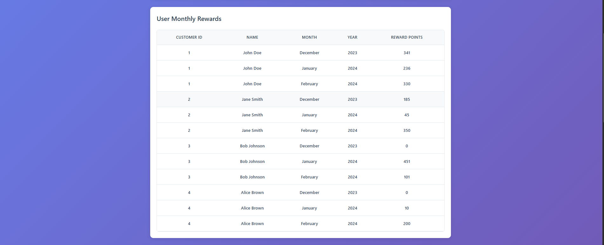
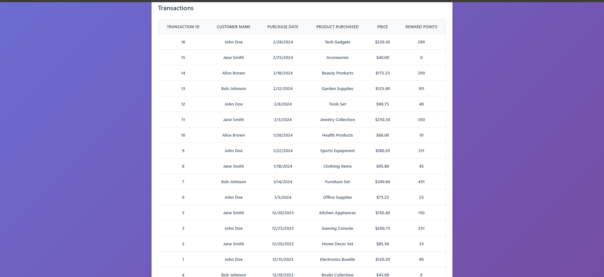

# Getting Started with Create React App

Customer Rewards Program (React)
================================

A React app that calculates reward points for customer purchases over time. It demonstrates pure functional calculations, cross-year month handling (Dec 2023, Jan 2024, Feb 2024), data fetching without artificial delays, PropTypes, ESLint, a minimal logger, and Jest unit tests.

Key Features
------------
- **Pure utilities**: No mutation; built with `map`, `reduce`, and pure helpers
- **Decimal handling**: `Math.floor` ensures 100.2 and 100.4 both award 50 points
- **Cross-year months**: December 2023 → January 2024 → February 2024
- **Sorting by date at render**: No sorting state; derived right before render
- **Aggregations**: Monthly breakdown and per-customer totals
- **PropTypes**: Props validated for all components
- **Logger**: Structured logs; no direct `console.log` left in code
- **Dynamic loading**: Based on real network latency (no artificial delays)
- **Jest tests**: Utilities and basic component rendering verified

Tech Stack
----------
- React 19 (CRA)
- Jest + Testing Library
- ESLint (rules configured within `package.json`)

Project Structure
-----------------
```
rewards-program/
  public/
    transactions.json                # Data source fetched by the app
  src/
    components/
      LoadingSpinner.js
      MonthlyRewardsTable.js
      TotalRewardsTable.js
      TransactionList.js
      __tests__/components.test.js   # Basic component tests
    data/
      service.js                     # Fetches /transactions.json
    utils/
      rewardsCalculation.js          # Pure calculation + sorting helpers
      logger.js                      # Minimal logger wrapper
      __tests__/rewardsCalculation.test.js
  docs/
    screenshots/                     # Place screenshots here
```

How the Calculations Work
-------------------------
- `calculateTransactionPoints(amount)`
  - ≤ $50 → 0 points
  - $50–$100 → 1 point per whole dollar above 50 (uses floor)
  - > $100  → 50 points + 2 points per whole dollar over 100 (uses floor)
- All aggregation helpers are pure and avoid mutation.

Data Source
-----------
- Transactions are fetched from `public/transactions.json` via `fetch` in `src/data/service.js`.
- The UI loading state is driven by the actual network request.

Running Locally
---------------
1) Install dependencies
```bash
npm install
```
2) Start the dev server
```bash
npm start
```
3) Run unit tests
```bash
npm test -- --watchAll=false
```
4) Lint
```bash
npx eslint src --ext .js,.jsx
```

Screenshots
-----------
Place screenshots under `docs/screenshots/` so they render in this README. The following images are referenced:

- App header and rules
  - `docs/screenshots/app-header-and-rules.png`
  
  

- Monthly rewards across years
  - `docs/screenshots/monthly-rewards.png`
  
  

- Transactions sorted by date
  - `docs/screenshots/transactions-table.png`
  
  

- Total rewards per customer
  - `docs/screenshots/total-rewards.png`
  
  

- Error state (missing `transactions.json`)
  - `docs/screenshots/error-state.png`
  
  

How to Capture the Error Screenshot
-----------------------------------
1) Temporarily rename `public/transactions.json` to `public/transactions.bak`
2) Reload the app; an error message appears and a structured log is produced by the logger
3) Take a screenshot and save it as `docs/screenshots/error-state.png`
4) Restore the file name to recover

Approach Notes
--------------
- Calculations use `Math.floor` to avoid fractional points and ensure consistent decimal handling
- Utilities are pure and avoid array/object mutation
- Sorting is performed during render with `sortTransactionsByDate`
- React hooks only (no Redux); state kept minimal and derived data computed on demand

GitHub
------
Create a new repository and push:
```bash
git init
git add .
git commit -m "feat: rewards program with pure calc utils, cross-year data, fetch service, logger, PropTypes, ESLint, Jest tests"
git branch -M main
git remote add origin <YOUR_REPO_URL>
git push -u origin main
```


