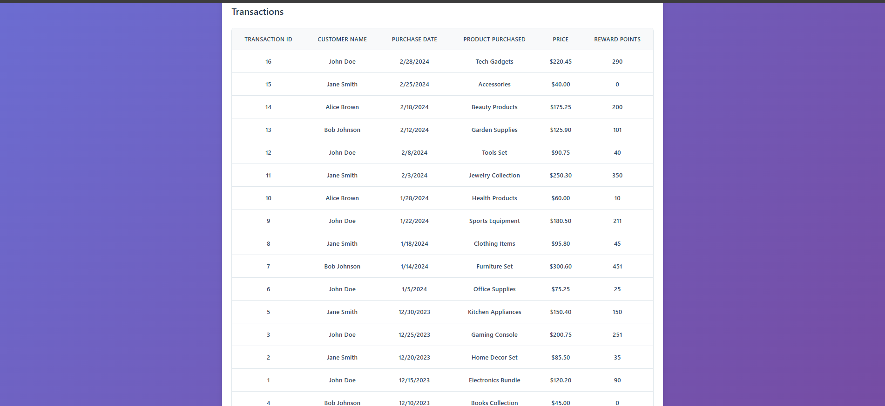

Documentation for Customer Rewards Program

Screenshots
- App header and rules
  
  

- Monthly rewards across years
  
  

- Transactions sorted by date
  
  

- Total rewards per customer
  
  

- Error state (e.g., when transactions.json is missing)
  
  

Notes
- If images do not render, ensure the PNG files exist at the paths above.
- You can capture the error screenshot by temporarily renaming `public/transactions.json` and refreshing the app.

